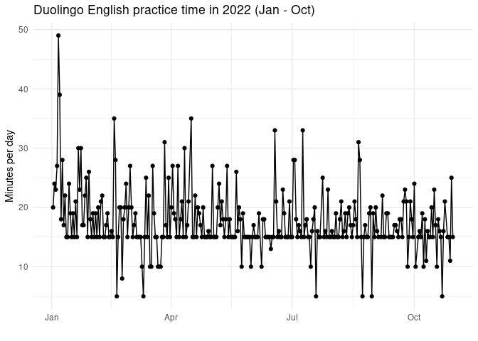

     library(tidyverse)

    ## ── Attaching packages ─────────────────────────────────────── tidyverse 1.3.2 ──
    ## ✔ ggplot2 3.3.6      ✔ purrr   0.3.5 
    ## ✔ tibble  3.1.8      ✔ dplyr   1.0.10
    ## ✔ tidyr   1.2.1      ✔ stringr 1.4.1 
    ## ✔ readr   2.1.3      ✔ forcats 0.5.2 
    ## ── Conflicts ────────────────────────────────────────── tidyverse_conflicts() ──
    ## ✖ dplyr::filter() masks stats::filter()
    ## ✖ dplyr::lag()    masks stats::lag()

     library(dplyr)
     library(lubridate)

    ## 
    ## Attaching package: 'lubridate'
    ## 
    ## The following objects are masked from 'package:base':
    ## 
    ##     date, intersect, setdiff, union

## Reading dataframe file containing a cronological record of minutes of practice on Duolingo

Check : Minutes count x 1000

      workdir ="/home/eduardovitor/Downloads/Loop Habits CSV 2022-11-11/001 Duolingo ingls/"
      checkmarks = paste(workdir,"Checkmarks.csv",sep="")
      df_checkmarks = read_csv(checkmarks)

    ## Rows: 306 Columns: 2
    ## ── Column specification ────────────────────────────────────────────────────────
    ## Delimiter: ","
    ## dbl  (1): check
    ## date (1): date
    ## 
    ## ℹ Use `spec()` to retrieve the full column specification for this data.
    ## ℹ Specify the column types or set `show_col_types = FALSE` to quiet this message.

      df_checkmarks$check <- df_checkmarks$check/1000

## Understanding dataframe structure

      str(df_checkmarks)

    ## spc_tbl_ [306 × 2] (S3: spec_tbl_df/tbl_df/tbl/data.frame)
    ##  $ date : Date[1:306], format: "2022-11-11" "2022-11-10" ...
    ##  $ check: num [1:306] 19 25 22 15 16 19 15 15 29 23 ...
    ##  - attr(*, "spec")=
    ##   .. cols(
    ##   ..   date = col_date(format = ""),
    ##   ..   check = col_double()
    ##   .. )
    ##  - attr(*, "problems")=<externalptr>

## Converting date column to class

    df_checkmarks$date <- as.Date(df_checkmarks$date,
                            format = "%y-%m-%d")
    class(df_checkmarks$date)

    ## [1] "Date"

## Getting data of year, month and day

      df_checkmarks <- df_checkmarks %>% mutate(month=month(date,label=TRUE),year=year(date),day=day(date))

## Removing November month because this month’s data is incomplete

      df_checkmarks <- df_checkmarks %>% filter(month!="Nov")

## Boxplots grouping data on practice time by month

      df_checkmarks %>% 
      group_by(month) %>% 
      ggplot(aes(x = month, y=check, fill=month)) +
      geom_boxplot()+
      theme_minimal()+
      theme(legend.position = "none")+
      labs(x="", y="Minutes", title = "Duolingo English practice time grouped by month (2022)")

## Line graph showing practice time throughout the months

      df_checkmarks %>% 
      ggplot(aes(x = date, y=check)) +
      theme_minimal()+
      geom_line()+
      geom_point()+
      labs(x="", y="Minutes per day", title="Duolingo English practice time in 2022 (Jan - Oct)")

## Plot showing English practice time during my vacation month

    df_checkmarks %>% 
      ggplot(aes(x = date, y=check)) +
      theme_minimal()+
      geom_line()+
      geom_point()+
      scale_x_date(limit=c(as.Date("2022-01-01"),as.Date("2022-01-31")))+
      labs(x="", y="Minutes per day", title="Duolingo English practice time during January")

    ## Warning: Removed 266 row(s) containing missing values (geom_path).

    ## Warning: Removed 266 rows containing missing values (geom_point).

\## Plot showing English practice time during a regular month in my
routine (June)

    df_checkmarks %>% 
      ggplot(aes(x = date, y=check)) +
      theme_minimal()+
      geom_line()+
      geom_point()+
      scale_x_date(limit=c(as.Date("2022-06-01"),as.Date("2022-06-30")))+
      labs(x="", y="Minutes per day", title="Duolingo English practice time during June")

    ## Warning: Removed 267 row(s) containing missing values (geom_path).

    ## Warning: Removed 267 rows containing missing values (geom_point).

\## Plot showing English practice time during a busy month in my routine
(October)

    df_checkmarks %>% 
      ggplot(aes(x = date, y=check)) +
      theme_minimal()+
      geom_line()+
      geom_point()+
      scale_x_date(limit=c(as.Date("2022-10-01"),as.Date("2022-10-31")))+
      labs(x="", y="Minutes per day", title="Duolingo English practice time during October")

    ## Warning: Removed 268 row(s) containing missing values (geom_path).

    ## Warning: Removed 268 rows containing missing values (geom_point).

## Understanding practice time data distribution with scatterplot

     df_checkmarks %>% 
      ggplot(aes(x = date, y=check)) +
      theme_minimal()+
      geom_point()+
      labs(x="", y="Minutes per day", title="Duolingo English practice time Scatterplot")

