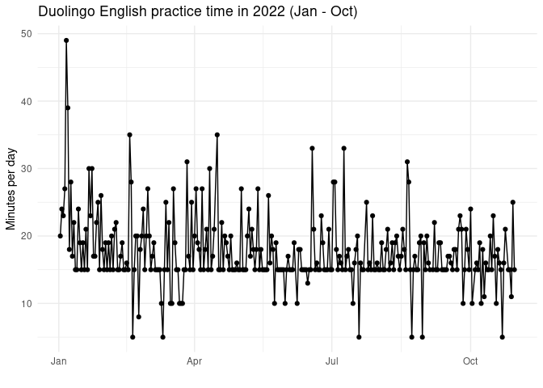

# Duolingo practice time R analysis
Hello visitor, this is a personal project on my English practice time dataframe of 2022. The data comes from the Loop Habit Tracker app. This analysis gave some insights of how my English studying habit behaved throughout the period of January to October. Here goes an interesting line graph chart that summarizes my discoveries:

